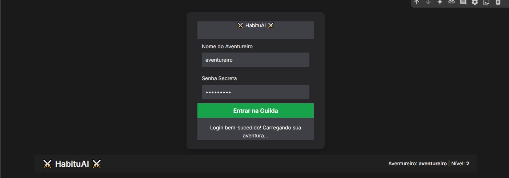
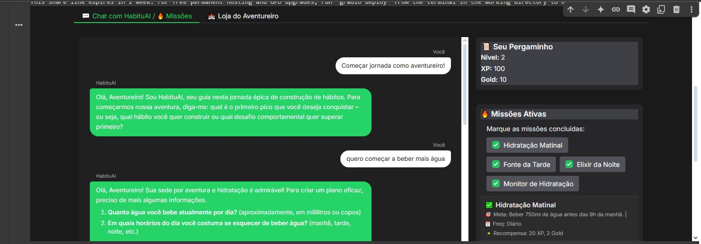
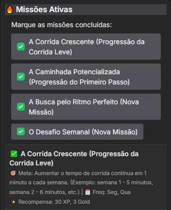
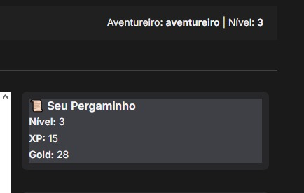

# HabituAI ⚔️ - Forje sua Lenda, um Hábito de Cada Vez!

    
    
    
    
    
  <h2>Acesse o Notebook:  https://colab.research.google.com/drive/155DYZMwqGcp9ZLJWiUKcXqyNA0MZqaD0?usp=sharing</h2>

  <!-- Adicione um logo para o HabituAI se tiver, ou remova esta seção -->
  <!--  -->

   
  <!-- Crie um banner legal para o HabituAI ou remova esta linha -->

## 1. 🔥 Sobre o Projeto

HabituAI é um aplicativo interativo e gamificado de construção de hábitos, desenvolvido como projeto para a Imersão IA da Alura. Utilizando o poder da Inteligência Artificial generativa (Google Gemini), este app transforma o processo de desenvolvimento pessoal em uma jornada épica de RPG, onde o usuário é o herói ("Aventureiro") e seus hábitos são as missões a serem conquistadas!

O objetivo é ajudar os usuários a definir, rastrear e manter hábitos positivos de uma forma divertida, motivadora e personalizada, recebendo orientação de um "Guia de Hábitos" virtual, o HabituAI.

## 2. 🖼️ Visão Geral da Interface

  <strong>Tela de Login</strong> 
  <em>Acesso seguro à sua jornada de hábitos.</em> 
  

 

  <strong>Chat Interativo com HabituAI</strong> 
  <em>Converse com seu guia para definir metas e receber missões.</em> 
  

 

  <strong>Dashboard de Missões e Perfil</strong> 
  <em>Acompanhe suas missões ativas, seu progresso (Nível, XP, Gold) e marque suas conquistas.</em> 
  

 

  <strong>Loja do Aventureiro (Vislumbre)</strong> 
  <em>Um espaço para futuras recompensas e itens para sua jornada.</em> 
  
  <!-- Ajuste a legenda se 'perfil.jpeg' mostrar o perfil ou outro aspecto -->

## 3. ✨ Funcionalidades Implementadas (MVP)

*   **Login Simulado:** Acesso inicial com credenciais pré-definidas, exibindo o nome do aventureiro na interface principal.
*   **Chat Inteligente com HabituAI:**
    *   Interação conversacional para o usuário expressar seus objetivos e desafios relacionados a hábitos.
    *   A IA (HabituAI) faz perguntas contextuais para refinar o entendimento.
    *   Geração de planos de "Missões" (hábitos) personalizadas com base na conversa.
*   **Sistema de Missões Gamificadas:**
    *   Nomes temáticos para cada missão.
    *   Metas claras, frequência e recompensas (XP e Gold).
*   **Dashboard Interativo:**
    *   **Perfil do Aventureiro:** Exibição de Nível, XP e Gold.
    *   **Missões Ativas:** Lista de missões atuais com checkboxes para marcar conclusão (atualização em tempo real na sessão).
*   **Progressão e Gamificação:**
    *   Acúmulo de XP e Gold ao concluir missões.
    *   Avanço de Nível com base no XP.
*   **Interface Temática e Responsiva:**
    *   Desenvolvida com Gradio, com tema escuro e destaques em verde, otimizada para uma experiência de RPG.
*   **Loja do Aventureiro (Conceito Inicial):**
    *   Aba dedicada que introduz a ideia de futuras recompensas e formas de utilizar o XP e Gold.

## 4. 🚀 Tecnologias e Competências

*   **Linguagem:** Python
*   **Inteligência Artificial Generativa:**
    *   API Google Gemini (modelo `gemini-1.5-flash-latest`).
    *   **Engenharia de Prompts Avançada:** Persona da IA (HabituAI), instruções de sistema complexas para fluxo conversacional e geração de conteúdo estruturado.
*   **Interface de Usuário (UI):**
    *   **Gradio:** Criação de interface web interativa.
    *   Customização de Temas e CSS.
    *   Gerenciamento de Estado da UI (`gr.State`).
*   **Lógica de Aplicação:** Gamificação (XP, Gold, Níveis), parseamento de texto da IA.
*   **Gerenciamento de Estado:** Variáveis Python para estado da sessão (em memória).
*   **Ambiente:** Google Colab.
*   **Controle de Versão:** Git e GitHub.

## 5. 🎯 Objetivos do Projeto (Foco na Imersão IA)

*   **Utilidade:** Oferecer uma ferramenta engajadora para o desenvolvimento de hábitos.
*   **Criatividade:** Unir IA conversacional e gamificação de forma inovadora.
*   **Eficácia da IA:** Demonstrar a IA como um coach adaptável.
*   **Engenharia de Prompts:** Evidenciar a capacidade de elicitar comportamentos complexos e respostas estruturadas da IA.

## 6. 🛠️ Como Executar

1.  **Acesse o Notebook:** [Link para o HabituAI no Colab]((https://colab.research.google.com/drive/155DYZMwqGcp9ZLJWiUKcXqyNA0MZqaD0?usp=sharing))
2.  **API Key:** Configure sua `GOOGLE_API_KEY` nos "Secrets" do Colab (o nome do secret deve ser `GOOGLE_API_KEY`).
3.  **Execute as Células em Ordem:**
    *   **Célula 1:** Instalações e Configuração da API.
    *   **Célula 2:** Definições de Backend (Estado, Constantes, Funções IA, Gamificação).
    *   **Célula 3:** Definição e Lançamento da Interface Gradio.
4.  **Acesse o Link Público:** Gerado pela Célula 3.
5.  **Login:** Use as credenciais simuladas (ex: usuário `aventureiro`, senha `habito123`).
6.  **Interaja:** Converse com o HabituAI!

## 7. 🗺️ Roadmap de Evolução (Próximas Aventuras)

O HabituAI está apenas no começo de sua jornada! Eis o que planejamos para o futuro:

*   **🛡️ Contas de Aventureiro e Persistência de Dados:**
    *   Sistema de cadastro/login seguro.
    *   Banco de dados (SQLite/Firebase) para salvar progresso, missões e perfil.
*   **🛒 Loja do Aventureiro Completa:**
    *   Itens compráveis com Gold/XP (customizações, bônus).
    *   Recompensas por nível e conquistas.
*   **📈 Dashboard de Progresso Detalhado:**
    *   Gráficos visuais do progresso dos hábitos.
    *   Histórico de missões e recompensas.
*   **🔔 Lembretes Inteligentes:**
    *   Notificações para auxiliar na manutenção dos hábitos.
*   **🤝 Elementos Sociais (Opcional):**
    *   Guildas, desafios em grupo, compartilhamento de progresso.
*   **🧠 IA Aprimorada:**
    *   Memória de longo prazo para um coaching mais personalizado.
    *   Feedback proativo com base no desempenho.
*   **⚙️ Customização de Missões pelo Usuário:**
    *   Edição de missões sugeridas e criação de missões próprias.

## 8. 🤝 Contribuições

Este projeto foi desenvolvido por João Batista Ribeiro Neto como parte da Imersão IA da Alura. Feedback e sugestões são muito bem-vindos para enriquecer esta jornada!

*Desenvolvido com 🧠 e 🔥 por João Batista Ribeiro Neto*

Principais Mudanças e Adaptações:

Título e Badges: Ajustei o título e os badges de tecnologia para refletir as ferramentas usadas no HabituAI.

Logo e Banner: Adicionei placeholders para um logo e banner do HabituAI. Se você não tiver, pode remover essas seções.

Número de Seções: Reorganizei para seguir uma numeração mais padrão (Sobre, Visão Geral, Funcionalidades, Tecnologias, Objetivos, Como Executar, Roadmap, Contribuições).

Texto das Seções: Adaptei o conteúdo para descrever o HabituAI, suas funcionalidades, tecnologias e objetivos, mantendo o tom do exemplo que você forneceu.

Imagens: Mantive a estrutura de exibição das imagens com width="70%" e align="center" para uma boa visualização.

Roadmap: Usei o termo "Roadmap de Evolução" e mantive as ideias de funcionalidades futuras que discutimos.

Detalhes de Execução: Ajustei as instruções para corresponder à estrutura de células que estabelecemos (Célula 1, 2, 3).

Nome da API Key: No "Como Executar", mencionei para configurar o secret como GOOGLE_API_KEY (sem o sufixo _HABITOS, a menos que você tenha usado esse nome específico no seu Colab). Ajuste se necessário.

Credenciais de Login: Adicionei um exemplo no "Como Executar".

Direitos Autorais/Status: Removi as seções "Status do Projeto" e "Direitos Autorais" do exemplo do "Juba", pois são muito específicas daquele contexto de processo seletivo. Se você quiser adicionar uma seção de licença ou status, pode fazê-lo.

Espero que esta versão do README esteja mais alinhada com o que você precisa para o HabituAI!
